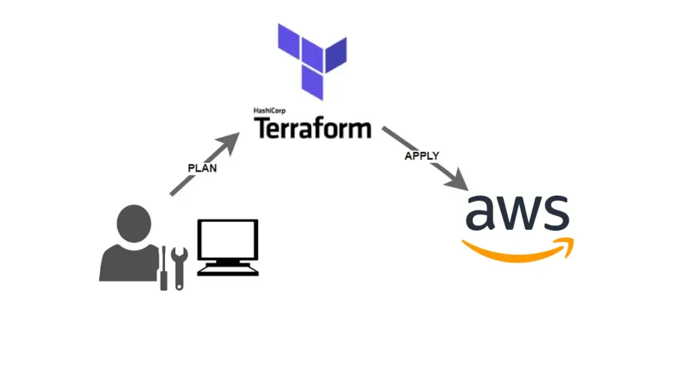
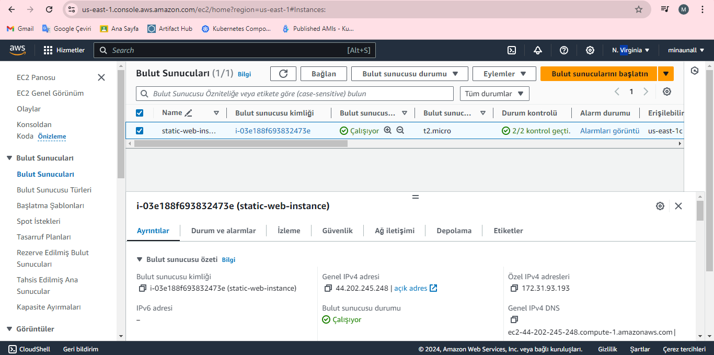
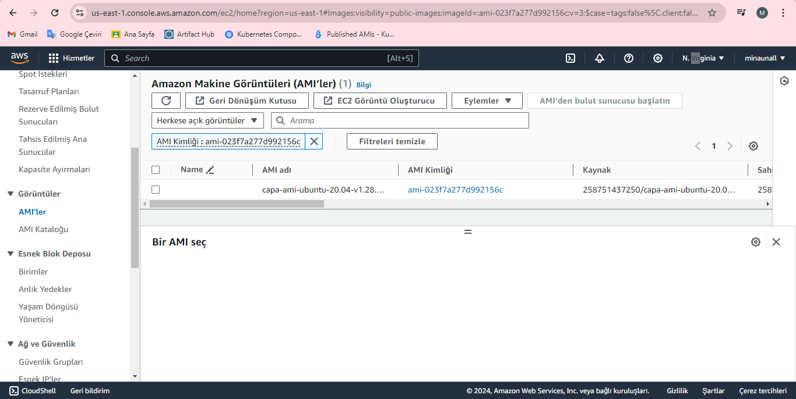
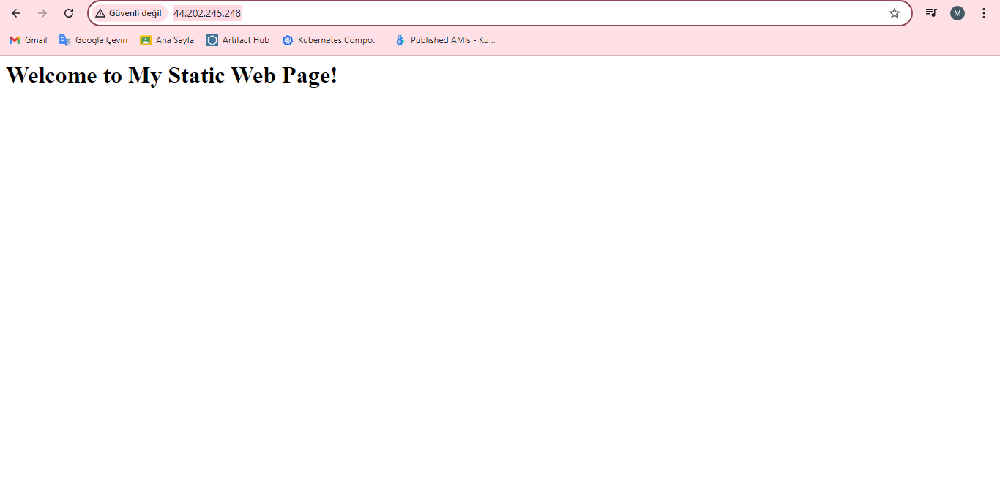

**This application creates a static web page from my own EC2 instance on AWS by using terraform. **
**Terraform is an orchestration tool for managing cloud instances like t2.micro.** 
  
Here is my main.tf file that keeps some info's about my EC2 instance.    
**resource "aws_instance" "web" {
  ami           = "ami-023f7a277d992156c" 
  instance_type = "t2.micro"

  user_data = file("bootstrap.sh")

  tags = {
    Name = "static-web-instance"
  }

  vpc_security_group_ids = [aws_security_group.web_sg.id]
}**
   
**ami**: Specifies the Amazon Machine Image (AMI) ID to be used for the EC2 instance. The given ami-023f7a277d992156c should be replaced with the latest and valid Ubuntu AMI ID for my region. I used us-east-1 for my app.  
**instance_type**: Defines the type of EC2 instance. t2.micro is a low-cost type that may be eligible for the AWS Free Tier.  
**user_data**: Specifies a script file to run when the EC2 instance is launched. Here, bootstrap.sh will be executed, typically used for initializing and configuring the instance (e.g., installing web servers).  
**tags**: Sets tags for the EC2 instance. In this case, it sets the "Name" tag to "static-web-instance."
**vpc_security_group_ids**: Associates the EC2 instance with the specified security group. aws_security_group.web_sg.id refers to the ID of the security group defined in the aws_security_group resource.  
**resource "aws_security_group" "web_sg" {
  name        = "web_sg"
  description = "Allow inbound HTTP traffic"

  ingress {
    from_port   = 80
    to_port     = 80
    protocol    = "tcp"
    cidr_blocks = ["0.0.0.0/0"]
  }

  egress {
    from_port   = 0
    to_port     = 0
    protocol    = "-1"
    cidr_blocks = ["0.0.0.0/0"]
  }
}**
  
**name**: The name of the security group.  
**description**: A description of the security group.  
**ingress**: Allows inbound HTTP traffic. The from_port and to_port settings open port 80 for HTTP traffic, and cidr_blocks permits traffic from all IP addresses (0.0.0.0/0).  
**egress**: Allows all outbound traffic. The from_port, to_port, and protocol settings allow all ports and protocols (-1), and cidr_blocks permits traffic to all IP addresses (0.0.0.0/0).  
Besides, we have to configure our ACCESS_KEY and SECRE_ACCESS_KEY by using $ aws configure command. This command is going to ask this variables to define them.  
After all that, we must initialize terraform, and then $ terraform apply command must be executed. 
When we switched by AWS UI, in the EC2->Instances tab; this machine must properly seem in there. 
  
If the check out our AMI, in the images tab, we must select public images option. Then our AMI will be seem in the AMI list. Here's my AMI: 
  
Lastly; when I go to the ipv4 address with http://, I can view my bootstrap static web page app properly. 

